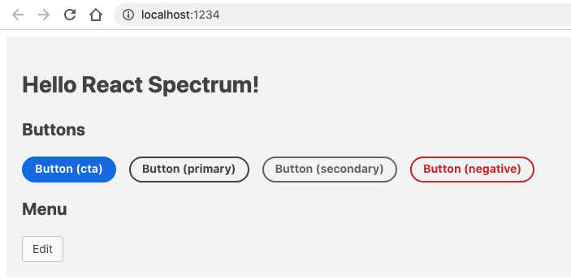

# react-spectrum-parcel-starter

[](https://github.com/msabramo/react-spectrum-parcel-starter/actions/workflows/test.yaml)

This is an example repo to show how to integrate [React Spectrum][] into a
React project with [Parcel][] as the bundler.

## Screenshot



## Get started

```sh
brew install gh
gh repo clone msabramo/react-spectrum-parcel-starter
cd react-spectrum-parcel-starter
yarn
PORT=1234 yarn dev
```

## See also

- [React Spectrum][]
- [Building a web app with Parcel][]
- https://github.com/evargast/webpack-react-spectrum
- [Next.js example with React Spectrum][]

[react spectrum]: https://react-spectrum.adobe.com/react-spectrum/
[parcel]: https://parceljs.org/
[building a web app with parcel]: https://parceljs.org/getting-started/webapp/
[next.js example with react spectrum]: https://github.com/reidbarber/rsp-next
